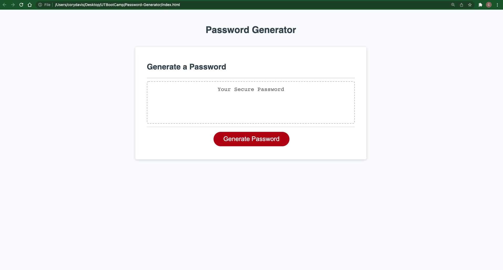

# Password Generator

## Description
This application assists you in easliy creating a password that consists of user selected groups of characters and a user inputted ength. To operated the password generator, navigate to the deployed site and follow the window confirmations and prompts. The first confirm is for uppercase characters. Select 'OK' to confirm uppercase character usage and cancel to not include them. You will then follow the same process for lowercase, numbers and special characters. The final prompt asks for the character length. Enter a number between 8 and 128 and the application will then provide you with a unique password using the provided specifications.

## Link to GitHub Repository
https://github.com/cmd0160/Password-Generator

## Link to Deployed Site
https://cmd0160.github.io/Password-Generator/

## Application Home Page

